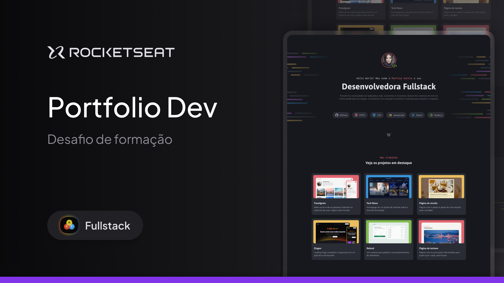

  

Projeto de desafio de portfólio de desenvolvedor na Rocketseat.

  <a href="#-tecnologias">Tecnologias</a>&nbsp;&nbsp;&nbsp;|&nbsp;&nbsp;&nbsp;
  <a href="#-projeto">Projeto</a>&nbsp;&nbsp;&nbsp;|&nbsp;&nbsp;&nbsp;
  <a href="#-layout">Layout</a>&nbsp;&nbsp;&nbsp;|&nbsp;&nbsp;&nbsp;
  <a href="#memo-licença">Licença</a>

  

 

  

## 🚀 Tecnologias

Esse projeto foi desenvolvido com as seguintes tecnologias:

- HTML
- CSS
- Git e Github
- Figma

## 💻 Projeto

Nesse projeto iremos desenvolver um portal de notícias para praticar o nosso conhecimento com o Grid!

- [Acesse o projeto finalizado, online](https://fernando-parise.github.io/portfolio-dev/)

## 🔖 Layout

Você pode visualizar o layout do projeto através [DESSE LINK](https://www.figma.com/design/ZTP9pbgMfBwbEkNNIDttc9/Portfolio-Dev--Community-?node-id=0-1&t=hvHytUXSAUl6TNCA-1). É necessário ter conta no [Figma](https://figma.com) para acessá-lo.

## :memo: Licença

Esse projeto está sob a licença MIT.